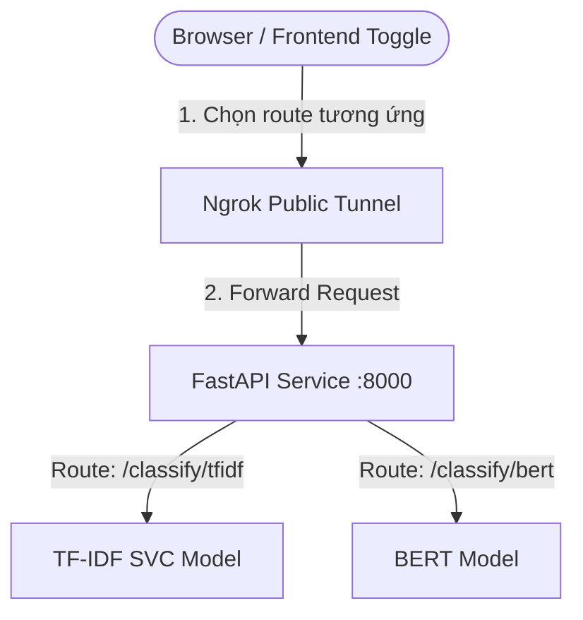

# 📰 Kế Hoạch Triển Khai Hệ Thống AI News Classification (Rút Gọn)

Bản kế hoạch này mô tả kiến trúc và thiết kế hệ thống **AI News Classification** (Phân loại tin tức tự động) hỗ trợ chuyển đổi linh hoạt giữa 2 mô hình **TF-IDF SVC** và **BERT** thông qua giao diện frontend và các API endpoint riêng biệt.

---

## 🏗️ 1. Kiến Trúc Tổng Quan (Architecture Overview)

- **Backend (FastAPI)**: Đóng gói 2 pipeline suy luận cho TF-IDF SVC và BERT, lắng nghe trên 2 route API độc lập.
- **Frontend (Web SPA)**: Trang nhập liệu đơn giản, tích hợp nút gạt chuyển đổi (Toggle) để chọn mô hình phân loại.
- **Ngrok Tunnel (Dockerized)**: Tự động phơi port API từ môi trường Docker cục bộ ra ngoài internet.



---

## 🔌 2. Thiết Kế API Routes (Separate Model Endpoints)

Hệ thống phân tách luồng xử lý của 2 mô hình trên 2 endpoint riêng biệt để tối ưu hóa hiệu năng, dễ dàng bảo trì và quản lý tài nguyên (RAM/GPU):

1. **Mô hình TF-IDF SVC (Lightweight)**:
   - **Endpoint**: `POST /api/v1/news/classify/tfidf`
   - **Payload Request**: `{"content": "..."}`
   - **Phản hồi**: Nhãn dự đoán, độ tin cậy và phân bổ xác suất (Xử lý cực nhanh trên CPU).

2. **Mô hình BERT (Deep Learning)**:
   - **Endpoint**: `POST /api/v1/news/classify/bert`
   - **Payload Request**: `{"content": "..."}`
   - **Phản hồi**: Nhãn dự đoán, độ tin cậy và phân bổ xác suất (Học ngữ nghĩa ngữ cảnh sâu sắc).

---

## 🐳 3. Cấu Hình Docker Compose & Ngrok Integration

File `docker-compose.yml` sẽ chịu trách nhiệm dựng cụm dịch vụ và tạo đường hầm ngrok ra môi trường bên ngoài:

```yaml
version: "3.9"

services:
  api:
    build:
      context: .
      dockerfile: Dockerfile
      target: runtime
    container_name: news_classifier_api
    ports:
      - "8000:8000"
    volumes:
      - ./models:/app/models:ro
    env_file:
      - .env
    restart: unless-stopped
    healthcheck:
      test: ["CMD", "curl", "-f", "http://localhost:8000/api/v1/news/health"]
      interval: 30s
      timeout: 10s
      retries: 3

  ngrok:
    image: ngrok/ngrok:latest
    container_name: news_classifier_ngrok
    restart: unless-stopped
    command:
      - "http"
      - "api:8000"
    environment:
      - NGROK_AUTHTOKEN=${NGROK_AUTHTOKEN}
    ports:
      - "4040:4040"
    depends_on:
      api:
        condition: service_healthy

volumes: {}
```

---

## 🎨 4. Thiết Kế Frontend UI (Tech Stack & Layout)

### Tech Stack
- **Cấu trúc (Structure)**: HTML5 ngữ nghĩa.
- **Giao diện (Styling)**: Modern Vanilla CSS (Hệ màu tối Dark Mode, phong cách Glassmorphism kính mờ sang trọng, và hiệu ứng chuyển tiếp mượt mà).
- **Hành vi (Behavior)**: ES6 JavaScript sử dụng API `fetch` tiêu chuẩn.

### Bố cục Giao diện (Layout) & Logic Toggle
Giao diện SPA được bố cục tuần tự từ trên xuống dưới trong một khung Glassmorphism tập trung:
1. **Tiêu đề (Header)**: Hiển thị tên ứng dụng và thông tin giới thiệu.
2. **Khu vực Điều khiển & Nhập liệu (Control & Input Area)**:
   - **Nút Toggle (Model Selector Switch)**: Nút gạt hoặc tab chuyển đổi hai chế độ **TF-IDF SVC (Lightweight)** và **BERT (Deep Learning)**.
     - *Logic chuyển đổi (Toggle Logic)*: JavaScript lắng nghe sự kiện click trên Toggle. Khi chọn TF-IDF, Javascript gán API endpoint đích là `/api/v1/news/classify/tfidf`. Khi gạt sang BERT, endpoint tự động đổi thành `/api/v1/news/classify/bert`.
   - **Khung soạn thảo (Textarea)**: Để người dùng dán nội dung văn bản tin tức cần phân loại.
   - **Nút gửi (Submit Button)**: Kích hoạt request gửi dữ liệu đến API endpoint tương ứng được xác định bởi trạng thái của nút Toggle.
3. **Khu vực kết quả (Result Area)**:
   - **Badge Chuyên mục**: Hiển thị lớp dự đoán (Sport, Business, Politics, Tech, Entertainment).
   - **Độ tin cậy**: Tỉ lệ phần trăm độ chính xác của dự đoán.
   - **Xác suất phân bổ**: Biểu đồ thanh ngang (Animated Progress Bars) thể hiện xác suất của từng chuyên mục trong 5 lớp.

---

## 🛠️ 5. Hướng Dẫn Chạy Nhanh (Quick Start)

1. Điền token ngrok của bạn vào `.env`: `NGROK_AUTHTOKEN=your_ngrok_token`
2. Chạy lệnh để khởi dựng hệ thống: `docker compose up -d`
3. Lấy địa chỉ public ngrok tại trang giám sát: `http://localhost:4040` để kiểm tra tài liệu API hoặc gửi dữ liệu.
